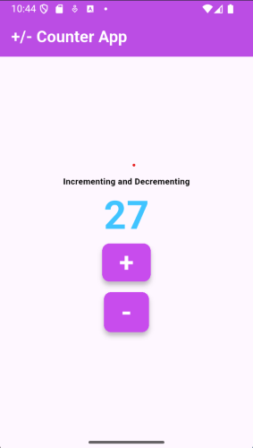

# COUNTER APP (Flutter Project)

## Overview
This is a Flutter application built using Dart. It is designed to be a cross-platform mobile application for Android and iOS.

## Installation

### Prerequisites
- Install [Flutter](https://flutter.dev/docs/get-started/install)
- Install [Dart](https://dart.dev/get-dart)
- Can Set up an emulator or connect a physical device(optional)

### Steps
1. Clone the repository:
   ```sh
   git clone https://github.com/vedantvisoliya/Counter-App.git
   cd counter_app
   ```
2. Install dependencies:
   ```sh
   flutter pub get
   ```
3. Run the app:
   ```sh
   flutter run
   ```
## Build & Release
### Android
```sh
flutter build apk
```
### iOS
```sh
flutter build ios
```

## Contributing
1. Fork the repository
2. Create a new branch (`feature/your-feature`)
3. Commit your changes (`git commit -m 'Add new feature'`)
4. Push to the branch (`git push origin feature/your-feature`)
5. Create a Pull Request

## Screenshots

